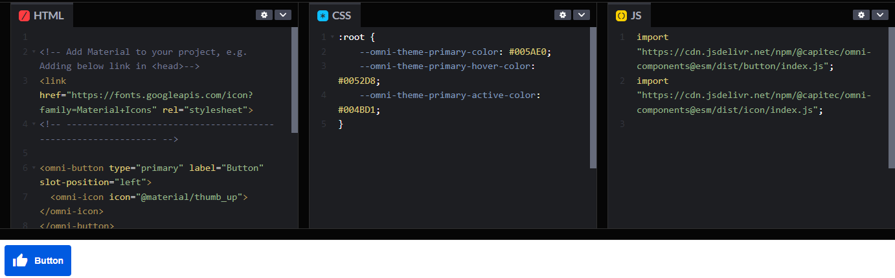

<!-- ⚠️ This README has been generated from the file(s) "readme/blueprint.md" ⚠️-->
<p align="center">
  
</p>

<p align="center">
  <b>Omni Components come with minimal dependencies to reduce the bloat in your project. All web components base off <strong>OmniElement</strong> (Which itself is based off <a href="https://lit.dev"><strong>LitElement</strong></a>) and are each available as fully standalone imports.</b></br>
  <sub><sub>
</p>

<br />


<p align="center">
		<a href="https://npmcharts.com/compare/@capitec/omni-components?minimal=true"></a>
<a href="https://www.npmjs.com/package/@capitec/omni-components"></a>
<a href="https://github.com/capitec/omni-components/actions/workflows/build.yml"></a>
<a href="https://github.com/capitec/omni-components/blob/develop/LICENSE"></a>
<a href="https://capitec.github.io/open-source/?repo=Omni-Components"></a>
	</p>


&nbsp;


<p align="center">
  <b>View our <a href="https://capitec.github.io/open-source/?repo=Omni-Components">full documentation</a> for more on component usage and live previews.</b></br>
  <sub><sub>
</p>


&nbsp;

[](#table-of-contents)

## Table of Contents

* [Getting Started](#getting-started)
* [UI Components](#ui-components)
* [Contributing and Usage](#contributing-and-usage)
	* [Setup](#setup)
	* [Contributors](#contributors)
	* [License](#license)
&nbsp;

[](#getting-started)

# Getting Started

Install Omni Components locally:

```bash

npm install @capitec/omni-components
```

Then import the components you require and start to use them in your project.

The following example shows how to import and use the ``<omni-button>`` as well as a slotted ``<omni-icon>`` with [Google Material Icons](https://fonts.google.com/icons).

> Import the required components
```js

import '@capitec/omni-components/button';
import '@capitec/omni-components/icon';
```
> or
```html

<script type="module" src="/node_modules/omni-components/dist/button/button.js" ></script>
<script type="module" src="/node_modules/omni-components/dist/icon/icon.js" ></script>
```
> Use the components in your project
```html

<!-- Add Material to your project, e.g. Adding below link in <head>-->
<link href="https://fonts.googleapis.com/icon?family=Material+Icons" rel="stylesheet">
<!-- ------------------------------------------------------------- -->

<omni-button type="primary" label="Button" slot-position="left">
  <omni-icon icon="@material/thumb_up"></omni-icon>
</omni-button>
```
[](https://codepen.io/capitec-oss/pen/eYrLaGZ)

For a more detailed installation guide, see [`INSTALLATION.md`](./INSTALLATION.md) as well as our [full documentation](https://capitec.github.io/open-source/?repo=Omni-Components).

&nbsp;


[](#ui-components)

# UI Components
<table style="max-width: 800px;"><thead><tr><th style="width: 100px;">Tag Name</th><th style="width: 600px;">Description</th></tr></thead><tbody><tr><td>

[omni-check](src/check/README.md)

</td><td>

A control that allows a user to check a value on or off.


```js


import '@capitec/omni-components/check';

```

</td></tr><tr><td>

[omni-button](src/button/README.md)

</td><td>

A control that allows an action to be executed.


```js


import '@capitec/omni-components/button';

```

</td></tr><tr><td>

[omni-chip](src/chip/README.md)

</td><td>

A control that can be used for input, setting attributes, or performing actions.


```js


import '@capitec/omni-components/chip';

```

</td></tr><tr><td>

[omni-hyperlink](src/hyperlink/README.md)

</td><td>

A link control that allows a user to indicate an action to be executed. Typically used for navigational purposes.


```js


import '@capitec/omni-components/hyperlink';

```

</td></tr><tr><td>

[omni-icon](src/icon/README.md)

</td><td>

Component that displays an icon


```js


import '@capitec/omni-components/icon';

```

</td></tr><tr><td>

[omni-check-icon](src/icons/README.md)

</td><td>

A check icon component.


```js


import '@capitec/omni-components/icons/Check.icon.js';

```

</td></tr><tr><td>

[omni-close-icon](src/icons/README.md)

</td><td>

A Close icon component.


```js


import '@capitec/omni-components/icons/Close.icon.js';

```

</td></tr><tr><td>

[omni-eye-hidden-icon](src/icons/README.md)

</td><td>

A hidden eye icon component


```js


import '@capitec/omni-components/icons/EyeHidden.icon.js';

```

</td></tr><tr><td>

[omni-eye-visible-icon](src/icons/README.md)

</td><td>

A visible eye icon component


```js


import '@capitec/omni-components/icons/EyeVisible.icon.js';

```

</td></tr><tr><td>

[omni-indeterminate-icon](src/icons/README.md)

</td><td>

An indeterminate icon component.


```js


import '@capitec/omni-components/icons/Indeterminate.icon.js';

```

</td></tr><tr><td>

[omni-loading-icon](src/icons/README.md)

</td><td>

A loading icon component.


```js


import '@capitec/omni-components/icons/Loading.icon.js';

```

</td></tr><tr><td>

[omni-lock-closed-icon](src/icons/README.md)

</td><td>

A closed lock icon component


```js


import '@capitec/omni-components/icons/LockClosed.icon.js';

```

</td></tr><tr><td>

[omni-lock-open-icon](src/icons/README.md)

</td><td>

A open lock icon component


```js


import '@capitec/omni-components/icons/LockOpen.icon.js';

```

</td></tr><tr><td>

[omni-minus-icon](src/icons/README.md)

</td><td>

A minus icon component


```js

import '@capitec/omni-components/icons/Minus.icon.js';

```

</td></tr><tr><td>

[omni-plus-icon](src/icons/README.md)

</td><td>

A plus icon component


```js

import '@capitec/omni-components/icons/Plus.icon.js';

```

</td></tr><tr><td>

[omni-label](src/label/README.md)

</td><td>

A simple label component that renders styled text.


```js


import '@capitec/omni-components/label';

```

</td></tr><tr><td>

[omni-number-field](src/number-field/README.md)

</td><td>

An input control that allows a user to enter a single line of numbers.


```js


import '@capitec/omni-components/number-field';

```

</td></tr><tr><td>

[omni-numeric-field](src/numeric-field/README.md)

</td><td>

An input control that allows a user to enter a single line of numbers with a stepper control.


```js


import '@capitec/omni-components/numeric-field';

```

</td></tr><tr><td>

[omni-password-field](src/password-field/README.md)

</td><td>

A password input control.


```js


import '@capitec/omni-components/password-field';

```

</td></tr><tr><td>

[omni-radio](src/radio/README.md)

</td><td>

A control that allows a user to select a single value from a group of values.


```js


import '@capitec/omni-components/radio';

```

</td></tr><tr><td>

[omni-render-element](src/render-element/README.md)

</td><td>

An element that defers content rendering to a provided function/promise.


```js


import '@capitec/omni-components/render-element';

```

</td></tr><tr><td>

[omni-switch](src/switch/README.md)

</td><td>

A control that allows a user to switch a value on or off.


```js


import '@capitec/omni-components/switch';

```

</td></tr><tr><td>

[omni-text-field](src/text-field/README.md)

</td><td>

A text input control.


```js


import '@capitec/omni-components/text-field';

```

</td></tr></tbody></table>


&nbsp;

[](#contributing-and-usage)

# Contributing and Usage

[](#setup)

## Setup

1. [Fork](https://github.com/capitec/omni-components/fork) the repository and create a branch from `develop`.
2. Clone the forked repo, checkout your branch, and run `npm ci` inside the repository root.
3. Start up the dev server with `npm run serve` (or by launching debugging in VS Code).

For more on contribution guidelines, see [`CONTRIBUTING.md`](./CONTRIBUTING.md).


[](#contributors)

## Contributors

<!-- readme: contributors -start -->
<table>
<tr>
    <td align="center">
        <a href="https://github.com/BOTLANNER">
            
            <br />
            <sub><b>BOTLANNER</b></sub>
        </a>
    </td>
    <td align="center">
        <a href="https://github.com/stefan505">
            
            <br />
            <sub><b>stefan505</b></sub>
        </a>
    </td>
    <td align="center">
        <a href="https://github.com/chromaticWaster">
            
            <br />
            <sub><b>chromaticWaster</b></sub>
        </a>
    </td>
    <td align="center">
        <a href="https://github.com/capitec-oss">
            
            <br />
            <sub><b>capitec-oss</b></sub>
        </a>
    </td></tr>
</table>
<!-- readme: contributors -end -->

[](#license)

## License
	
Licensed under [MIT](https://opensource.org/licenses/MIT).
